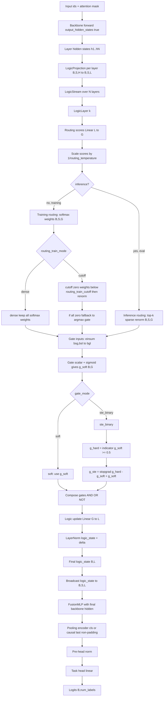
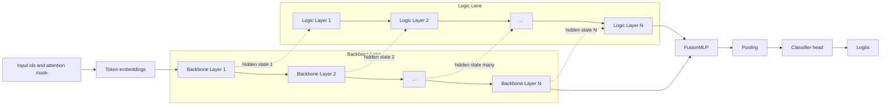

# Logic-Stream STE Mode Mermaid Graphs

These diagrams reflect the current implementation:
- STE gate mode is enabled by `model.gate_mode: ste_binary`.
- Training routing supports both `dense` and `cutoff` modes.
- Router softmax uses configurable `routing_temperature`.
- Inference uses top-k sparse routing.
- STE is applied only at gate binarization, not the full logic path.

## Option Checklist For This Diagram

- `model.gate_mode`: `soft` or `ste_binary`
- `model.routing_train_mode`: `dense` or `cutoff`
- `model.routing_train_cutoff`: threshold in `[0,1)` for cutoff mode
- `model.routing_temperature`: softmax temperature `> 0`
- `model.routing_top_k`: inference-time sparse top-k

## Forward Flow (STE Mode)

## Backward Flow (STE Surrogate Gradient)

```mermaid
flowchart LR
  L0[Loss CE logits labels]
  H0[Task head]
  F0[FusionMLP]
  LS[Logic state update path]
  CG[Gate composition output]
  STE[g_ste node]
  GS[g_soft sigmoid output]
  TH[Hard threshold indicator]
  GP[Gate scalar projection]
  EI[Einsum token to gate aggregation]
  RT[Routing softmax weights training]
  PR[LogicProjection]
  BB[Backbone hidden states if unfrozen]

  L0 --> H0 --> F0 --> LS --> CG --> STE --> GS --> GP --> EI --> RT --> PR --> BB
  TH -.forward value only.-> STE
  STE -.surrogate gradient to g_soft.-> GS
```

## Accuracy Notes

1. `loss.backward()` drives the gradient pass from logits.
2. In training with `routing_train_mode=dense`, routing returns full softmax weights.
3. In training with `routing_train_mode=cutoff`, low softmax weights are dropped then renormalized.
4. Cutoff mode uses argmax fallback when all gates are removed for a token.
5. Router uses `softmax(scores / routing_temperature)` with `routing_temperature > 0`.
6. Top-k routing runs only when `inference=True` (evaluation path).
7. In `ste_binary`, only the hard-threshold derivative is bypassed via STE.
8. Gradients still pass through routing, einsum, gate scalar, logic update, fusion, and task head.

## Potential Train-Eval Mismatch Risk

There is an important evaluation caveat in the current design:

1. During training, routing uses either:
- `routing_train_mode=dense` (full softmax), or
- `routing_train_mode=cutoff` (thresholded softmax + renormalization).

2. During evaluation/inference, routing switches to top-k sparse routing (`routing_top_k`).

This means the routing operator at test time is not identical to the training operator. That can introduce a distribution shift in gate selection and reduce accuracy, especially when:

- `routing_temperature` is low (very sharp routing),
- `routing_top_k` is small (aggressive sparsification), or
- cutoff thresholding and top-k ranking disagree on which gates survive.

Practical interpretation:

- `dense` train -> `top-k` eval is usually the largest operator gap.
- `cutoff` train -> `top-k` eval may be closer, but still not identical.

Suggested evaluation practice:

1. Report a matched-routing metric (eval with train-like routing behavior) to measure representation quality.
2. Report top-k inference metric to measure deployment behavior.
3. Treat the delta between these two as sparsification mismatch cost.

## Architecture View A: U-Net-Inspired Layout

This view mirrors the familiar U-Net visual style (left-to-right with skip links), adapted to a transformer backbone with logic-side processing.

```mermaid
flowchart LR
  %% U-Net style: left path (feature extraction), bottleneck logic stream, right path (fusion + prediction)
  subgraph ENC[Encoder Path - Backbone Features]
    E0[Input tokens]
    E1[Embedding + Layer 1 hidden]
    E2[Layer 2 hidden]
    E3[...]
    E4[Layer N hidden]
    E0 --> E1 --> E2 --> E3 --> E4
  end

  subgraph BOT[Bottleneck Logic Stream]
    B0[LogicProjection per layer H to L]
    B1[RoutingModule + temperature]
    B2[Gate block AND OR NOT]
    B3[Logic update + LayerNorm]
    B0 --> B1 --> B2 --> B3
  end

  subgraph DEC[Decoder-Like Fusion Path]
    D1[Fusion with final hidden]
    D2[Pooling cls or causal-last]
    D3[Pre-head norm]
    D4[Classifier head]
    D5[Logits]
    D1 --> D2 --> D3 --> D4 --> D5
  end

  E4 --> B0
  B3 --> D1

  %% Skip-style links (U-Net flavor): intermediate backbone signals remain available
  E1 -. skip context .-> D1
  E2 -. skip context .-> D1
  E3 -. skip context .-> D1

  %% STE annotation
  B2 -. ste_binary uses hard forward and soft backward gradient .-> B3
```

## Architecture View B: Classic Transformer-Style Stack

This view matches the canonical transformer diagram style: repeated layer blocks with a parallel logic stream and a final classification head.

